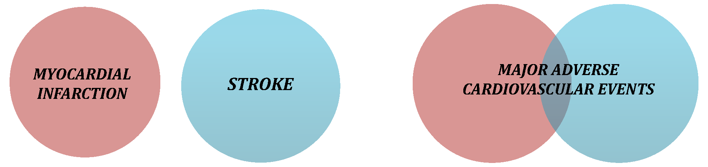

```{r setup, include=FALSE}
knitr::opts_chunk$set(echo = FALSE)
```

##  Welcome to CompARE! 

This tutorial introduces you to CompARE, a web-tool for designing trials with composite endpoints. 

<a href="https://cinna.upc.edu/compare/" class="button">Go to CompARE!</a> 


# What is a Composite Endpoint?

## What is a Composite Endpoint?


A composite endpoint consists of two or more outcomes combined in a unique endpoint. Patients who have experienced any one of the events specified by the components are considered to have experienced the composite outcome.

**Rationale behind the use of Composite Endpoints:**

- Decrease in Sample Size Required to Show Effects
- Assessment of the "Net" Effect of an Intervention
- Assessment of the Effect in Presence of Competing Risks
 




# The parameters of the Composite Endpoint

## Composite parameters

Probability of observing the Composite Endpoint:


  - $p_*^{(0)}$: Probability of observing the Composite Endpoint  in control group
  - $p_*^{(1)}$: Probability of observing the Composite Endpoint  in treatment group

Effect measures for the Composite Endpoint:

|   | Parameter Effect |Null hypothesis | Alternative hypothesis   |
| ------------- |:-------------|:-------------:| -----:|
| Risk difference | $\delta_* = p_*^{(1)} - p_*^{(0)}$  | $\delta_* = 0$  | $\delta_* < 0$  | 
| Relative risk | $\textrm{R}_* = p_*^{(1)}/p_*^{(0)}$  | $\log( \textrm{R}_* ) = 0$ | $\log( \textrm{R}_* ) < 0$ |  
| Odds ratio | $\textrm{OR}_* = \frac{p_*^{(1)}/q_*^{(1)}}{p_*^{(0)}/q_*^{(0)}}$  | $\log( \textrm{OR}_* ) = 0$ | $\log( \textrm{OR}_* ) < 0$ |  

<!-- ## Sample size calculation  -->

<!-- - Bullet 1 -->
<!-- - Bullet 2 -->
<!-- - Bullet 3 -->

Both the composite probabilities and effect depend on the composite components and on the association between them. To calculate the composite parameters and the sample size, you can use CompARE.

# Case Study


## 

### Part 1 - The association between the composite components

Consider the event probabilities under the control group $0.07$ and $0.15$ and the risk ratios $0.7$ and $0.6$ for the Endpoint 1 and 2, respectively. Assume a correlation equal to $0.1$.


- Which are the possible values for the correlation? 
- Which is the probability of having both events if the patient is allocated in the control group? And if the patient is in the treatment group? 
- Which is the relationship between the correlation and the probability of overlap? What happens if we increase the correlation between the components? 

##

### Part 2 - The probability of the composite endpoint

Consider the event probabilities under the control group $0.07$ and $0.2$ and the risk ratios $0.8$ and $0.5$ for the Endpoint 1 and 2, respectively. Assume a correlation equal to $0.2$.

- Which would be the probability of observing the composite event under the control group if the correlation is $0.1$? What if the correlation is $0.45$?  Interpret the results.


## 

### Part 3 - The effect on the composite endpoint

Consider the event probabilities under the control group $0,07$ and $0.15$ and the odds ratios $0.8$ and $0.65$ for the Endpoint 1 and 2, respectively. Assume a correlation equal to $0.1$.


- Compute the risk difference for the composite components.
- Compute the risk difference for the composite endpoint with a correlation of $0.45$.
- Describe the risk difference for the composite endpoint as compared with the risk difference for the components. 

## 

### Part 4 - The sample size for the composite endpoint

Consider that the probability for the Endpoint is $0.1$; the probability for the Endpoint 2 is $0.15$. 
You expect a risk reduction for the Endpoint 1 of $0.80$ and  $0.65$ for the Endpoint 2. Consider the risk difference as the measure for testing the treatment differences between groups.

- How much sample size is needed for testing treatment differences using the Endpoint 1 as Primary endpoint?
- Assume that the composite components are moderately correlated, how much sample size is needed for testing treatment differences using the Composite Endpoint  as Primary endpoint? 

Consider that the probability for the Endpoint 1 takes values between $0.078$ and $0.112$; the probability for the Endpoint 2 takes values between $0.117$ and $0.17$. You guess that the correlation between the composite components is weak and expect a relative risk for the Endpoint 1 of $0.85$ and  $0.75$ for the Endpoint 2. 
<!-- Consider the risk difference as the measure for testing the treatment differences between groups. -->

- How much sample size is needed for testing treatment differences in the Composite Endpoint using the risk difference?


##  

### Part 4 (II) - The sample size for the composite endpoint


Reproduce the sample size calculation in the paper:

*Cannon CP, Weintraub WS, Demopoulos LA, et al. Comparison of Early Invasive and Conservative Strategies in Patients with Unstable Coronary Syndromes Treated with the Glycoprotein IIb/IIIa Inhibitor Tirofiban. New England Journal of Medicine. 2001;344(25):1879-1887. * 

- Is the sample size consistent with the parameters of the composite components?
- What sample size would you have used? Why?
<!-- - **Primary endpoint**: the combined incidence of death, nonfatal myocardial infarction and rehospitalization for an acute coronary syndrome at six months. -->


# THANK YOU VERY MUCH!

<!-- ## References -->

<!-- - Composite Endpoints in Clinical Trials, Ignacio Ferreira-González, et al., 2008. <http://www.revespcardiol.org/en/composite-endpoints-in-clinical-trials/articulo/13117550/> -->
<!-- - Bullet 2 -->
<!-- - Bullet 3 -->


